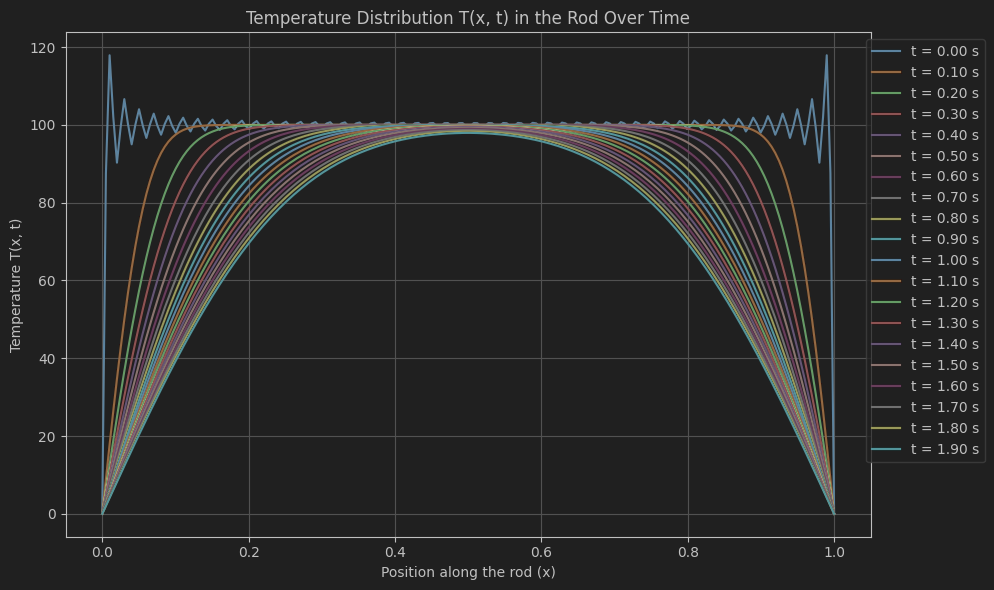

# Heat Equation Solver using Fourier Series (1D)

This repository presents a numerical simulation of the one-dimensional heat conduction in a rod, based on the analytical solution of the heat equation using a Fourier series. The project is implemented in Python using `NumPy` and `Matplotlib`.

---

## 📘 Description

This project simulates the temperature distribution `T(x, t)` in a one-dimensional rod of length `L`, given an initial temperature profile. The solution is based on the analytical solution of the 1D heat equation with Dirichlet boundary conditions (T=0 at both ends), using the classical Fourier sine series expansion.

---

## 🔍 Governing Equation

The heat equation (1D) is given by:

$$
\frac{\partial T}{\partial t} = \alpha \frac{\partial^2 T}{\partial x^2}
$$

With:
- Initial condition: \( T(x, 0) = T_0 \)
- Boundary conditions: \( T(0, t) = T(L, t) = 0 \)

The analytical solution using the Fourier sine series is implemented.

---

## 🔢 Parameters

- `L = 1` : Length of the rod  
- `T0 = 100` : Initial temperature of the rod  
- `alpha = 0.01` : Thermal diffusivity  
- `terms = 100` : Number of terms in Fourier series  
- `x = np.linspace(0, L, 200)`  
- `t = 0 to 10 seconds` with step `0.25`

---

## 📈 Output

The result is a dynamic plot of the temperature distribution over time, showing how the rod cools down from its initial temperature distribution.

Example:



---

## 🚀 Requirements

Install the required Python packages using:

```bash
pip install numpy matplotlib
